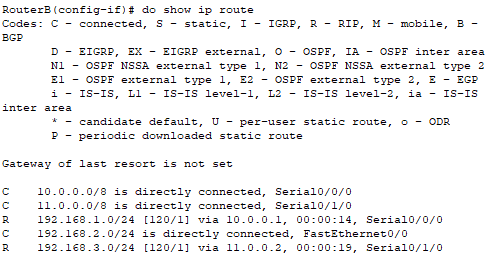
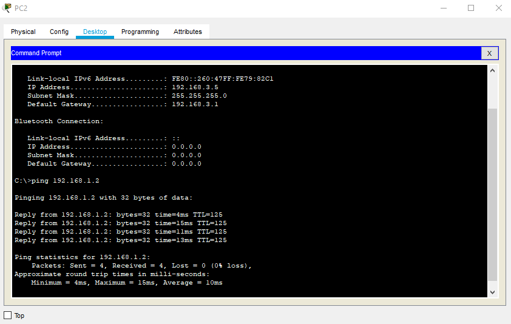

# Routing Information Protocol (RIP)

### CLI code for RIP
> #en
- #config t
- #interface serial 0/1/0
- #ip address 10.0.0.1 255.0.0.0
- #router rip
- #version 2
- #no auto-summary
- #network 192.168.2.1
- #network 11.0.0.1
- #network 10.0.0.2
- #no shut
- #do show ip route

# Dynamic Host Configuration Protocol (DHCP)

### CLI code for DHCP pool
> #en
- #config t
- #ip dhcp pool nameA
- #network 192.168.3.0 255.255.255.0
- #Default-router 192.168.3.1
- #DNS-Server 8.8.8.8

